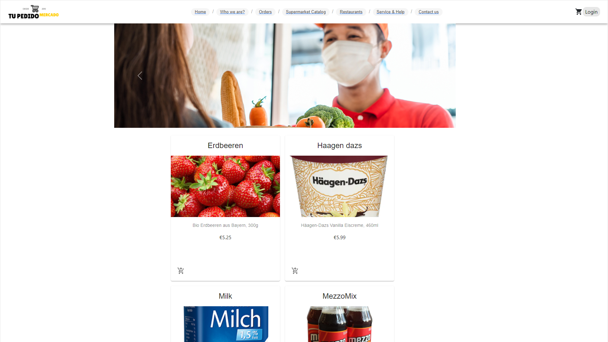

TuPedido

TuPedido es una aplicacion pensada para su uso en Cuba donde es muy comun en una misma aplicacion encontrar los mejores platos de los restaurantes y la compra del supermercado.

**Demo:** https://rrmoreno.github.io/tupedido-RRafols/home

**Pasos a seguir para correr local**
* Clonar de https://github.com/RRMoreno/tupedido-RRafols
* Instalar las dependencias con `npm install` o `yarn`
* Correr la aplicacion: `npm run start` o `yarn run start`

**Algunas Librerias usadas**
* https://www.npmjs.com/package/@auth0/auth0-react Auth0 para la autenticacion con redes sociales
* https://material-ui.com/ Componentes visuales para un look and feel basado en el Material Design de Google
* Bootstrap 5  para el Carousel
* Firebase para la BD en la nube
* https://www.npmjs.com/package/clsx Para una definicion mas facil de clases y estilos
* https://www.npmjs.com/package/validator Para validaciones
* https://reactrouter.com/ Para la navegacion Client-Side

